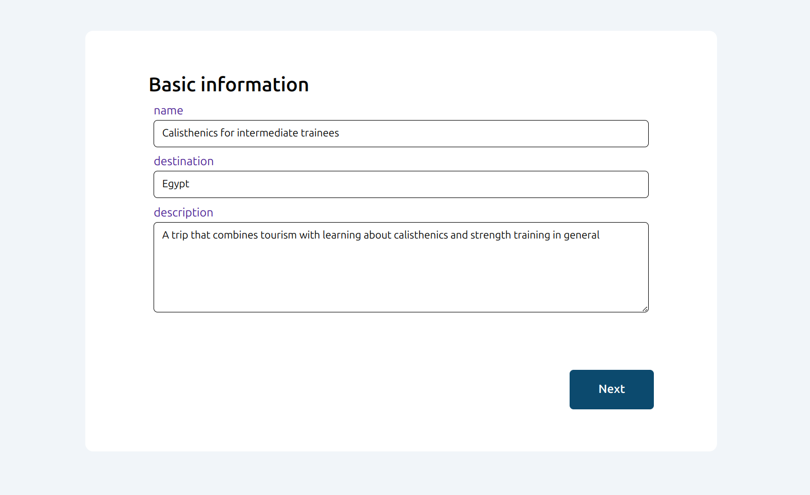
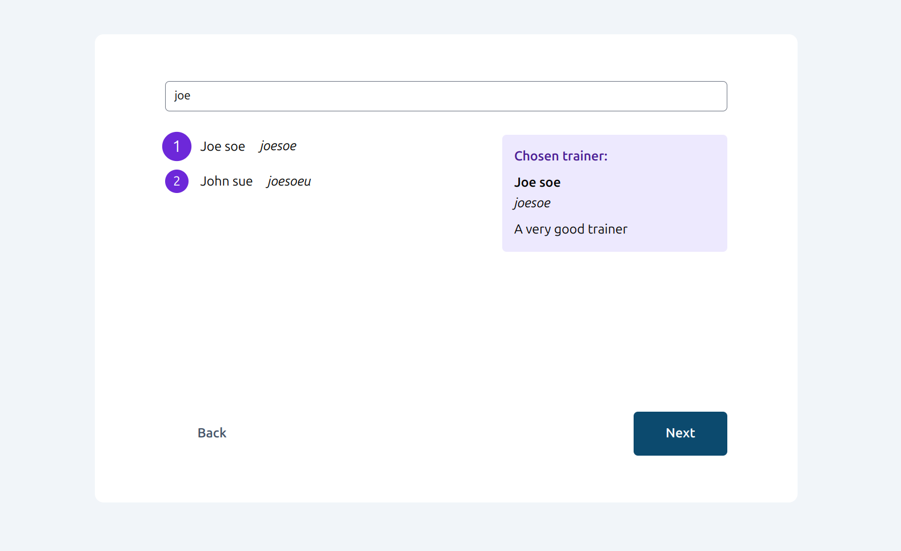
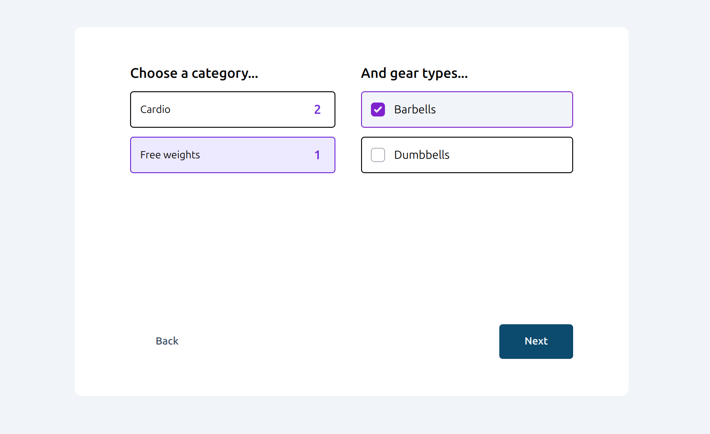
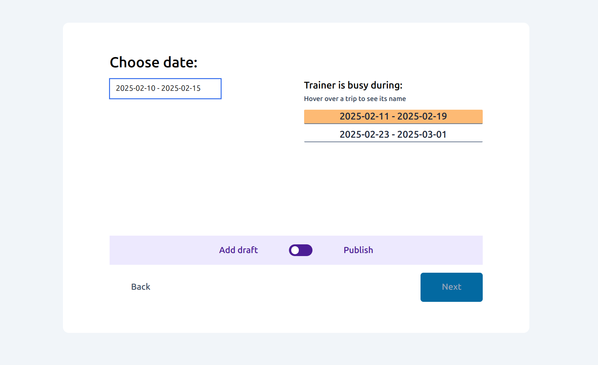

# Personal Trainers App

## Running the application with docker compose
To run the application clone the repository and use the following command.
```bash
docker compose up
```
The application should be available at http://localhost:80 (or just http://localhost).

## Plan a Trip/Workshop functionality screenshots



